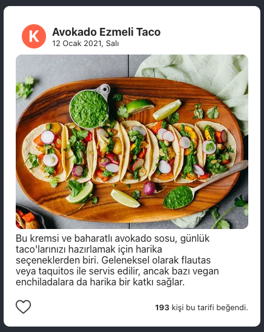

# Recipe Card

In this project we are creating the card that will be displayed for each dish on a recipe website. The Card Component in the project shows the details of a recipe, the author, the number of likes and some information about whether the user likes the recipe.

  

### How to Run a Project

- After forking or downloading the project, the necessary packages must be installed with the "npm install" command in the folder where the project is located.
- Then the application can be started with the command "npm run start".

### About the project

The Card Component receives certain "props" to list information about the meal.
These "props" are named author, recipe, count, liked, respectively.

### To-do

Make the places in the Card component dynamic so that the places given as placeholder text will be taken as props. Then, make sure that the necessary places are rendered by passing through App.js as a prop.

### Note

1. Currently imported and displayed in the food image Card component. Edit it so that the image named Food will also come as a prop.

2. It has been passed as an author prop for an example. It is rendered to take the first letter of the  'author prop in the' 
 'named profile in the Card component.
